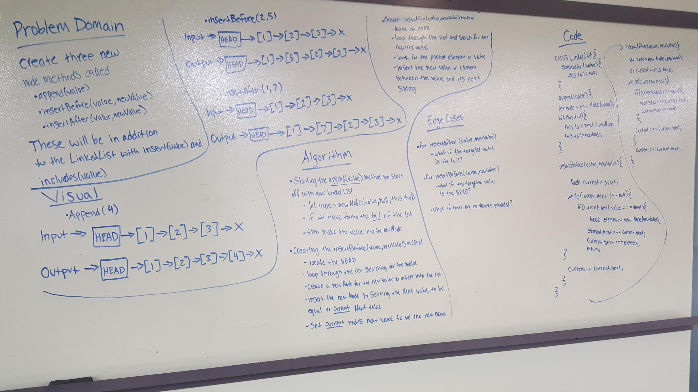

# Linked List

## Challenge
*  We neeed to make a Node class that was going to have properties for the values stored in the Node and then would point to the next Node
* In your linkedList class you need to include a head property, and then an empty Linked List needs to be created 
    * The object should be aware of a default empty value that is assigned to head when the linked list is represented
    * You need to define a method called insert that takes any values as an arugment and then adds a new Node with that value to the head of the list with an O(1) Time Performance 
    * You need to define a method called includes that takes any value as an argument and thenreturns a boolean result depending on whether that value exists as a Node's value somewhere within the list 
    * You need to define a method called print that will take in no arguments and ouputs all of the current Node values in the Linked List 
  * At no time should an exception or stack trace be shown to the end user. Catch and handle any such exceptions and return a printed value or operation which cleanly represents the state and either stops execution cleanly, or provides the user with clear direction and output.
  * Be sure to follow your language/frameworks standard naming conventions (e.g. C# uses PascalCasing for all method and class names).

## Approach and Efficiency
* Starting off by going back to class lecture and review notes throughout 
* Following step by step through theinstructions
* Doing some research to figure what all I needed to do 
* Referring back to other labs to help with writting tests
* Created my Node constructor 
* Created the Linked List insert, includes, and print method arguments 
* Went through testing for each 

## API
* For the insert method argument you have your insert(value) so that you are able to add in new values when needed or want
* For the includes method argument you have your includes(value) so that you are able to check if that value exists in your list or not
* For the print method argument you have your print() so that you are able to see all of the different items that are included in your list

## Solution
