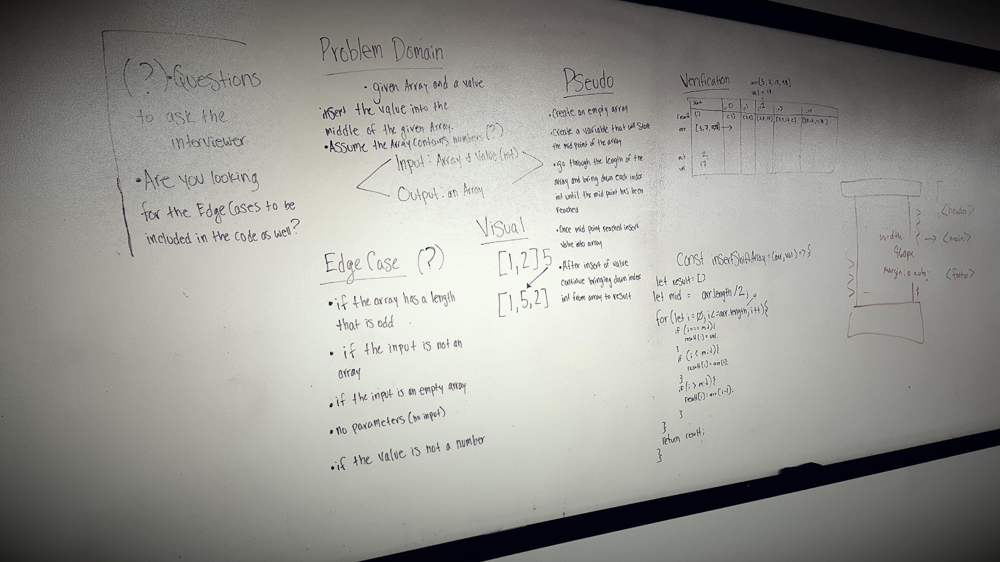

# Array Shift
Array Shift is to take a given array and shift integers over to left or right so you are able to input a new interger.

## Challenge 
This code challenge was to be able to take a given array and a given value and return an new modified array based on the original. The object was to take the given value and write code so that the value is placed in the center of the original array. 

## Approach and Efficiency
The approach that we took for this was to write everythign out on the writeboard. We wrote out the algorithm for the problem, the code that we planned on writing, the psedo code, went went through the verification, the problem domain, and then the visual to the problem. We wrote it all out on the whiteboard to get a good visual on what steps we needed to make and how to execute the problem. 

## Solution 
