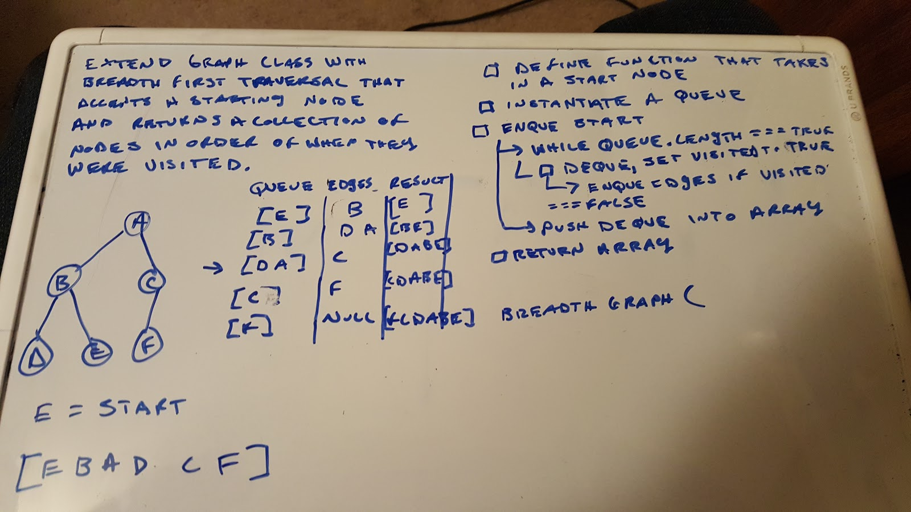
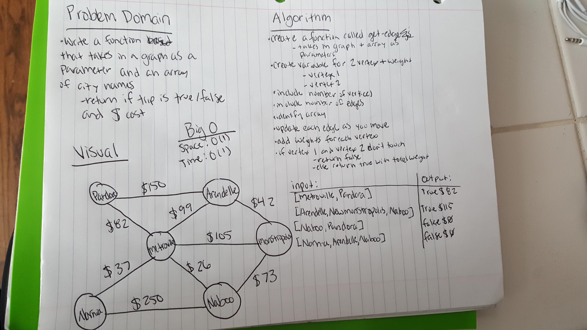
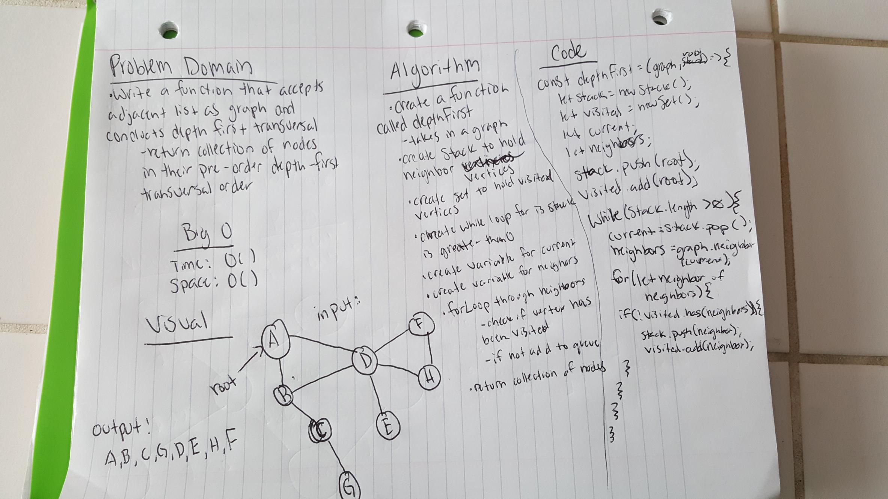

## Graphs

### Author: Siobhan Niess

### Links and Resources
* [repo](https://github.com/niesssiobhan/data-structures-and-algorithms/tree/master/code-challenges/graph)
* [travis](https://www.travis-ci.com/niesssiobhan/data-structures-and-algorithms)

### Modules
#### `graph.js`
##### Challenge
* AddNode()
Adds a new node to the graph
Takes in the value of that node
Returns the added node
* AddEdge()
Adds a new edge between two nodes in the graph
Include the ability to have a “weight”
Takes in the two nodes to be connected by the edge
Both nodes should already be in the Graph
* GetNodes()
Returns all of the nodes in the graph as a collection (set, list, or similar)
* GetNeighbors()
Returns a collection of nodes connected to the given node
Takes in a given node
Include the weight of the connection in the returned collection
* Size()
Returns the total number of nodes in the graph
#### `breadth-first.js`
##### Challenge
* Extend your graph object with a breadth-first traversal method that accepts a starting node. Without utilizing any of the built-in methods available to your language, return a collection of nodes in the order they were visited. Display the collection.
#### `get-edge.js`
##### Challenge 
* Write a function based on the specifications above, which takes in a graph, and an array of city names. Without utilizing any of the built-in methods available to your language, return whether the full trip is possible with direct flights, and how much it would cost.
#### `depth-first.js`
##### Challenge
* Create a function that accepts an adjacency list as a graph, and conducts a depth first traversal. Without utilizing any of the built-in methods available to your language, return a collection of nodes in their pre-order depth-first traversal order.

## Approach & Efficiency
### Graphs
* I was able to follow along with the methods taught in class 
* For each of the methods I would believe that the Big O would be O(1)
### Breadth First
* My approach to this was reviewing back on the breadth-first on the trees method
* I would have to say that the Big O for this would be O(w)
### Get Edge
* My approach to this was doing some research online and going over lecture notes 
* I would have to say that the Big O for this would be O(1) for both time and space
### Depth First
* My approach to this was starting at the root and then moving down to the next neighbor until each vertex has been visited
* I would have to say that the Big O for this would be O(|v|) for time and O(|v|) for space

## API
* AddNode() this will add a node to the graph and then return the value 
* AddEdge() this will add on an edge between the nodes (this can include weight)
* GetNodes() this wil return all nodes as a collection
* GetNeighbors() this will return a list of all nodes connected to the node that was given
* GetSize() this will return the number of nodes that are in the graph

#### Tests
* How do you run tests?
npm test
* What assertions were made?
* What assertions need to be / should be made?

#### Collaborators
* Jon

### To-do list
- [x] Read all of these instructions carefully
- [x] All work in the correct remo
- [x] Work on the correct branch
- [x] Work in the correct folder
- [x] Work in the correct file
- [x] Create the code
- [x] Write at least three test assertions for each method that you define.
- [x] Ensure your tests are passing before you submit your solution.
- [x] Create a pull request from your branch to your master branch
- [x] In your open pull request, leave as a comment a checklist
- [ ] Submitting your completed work to Canvas (soon)
- [ ] Merge your branch into master (soon)

#### Solution

