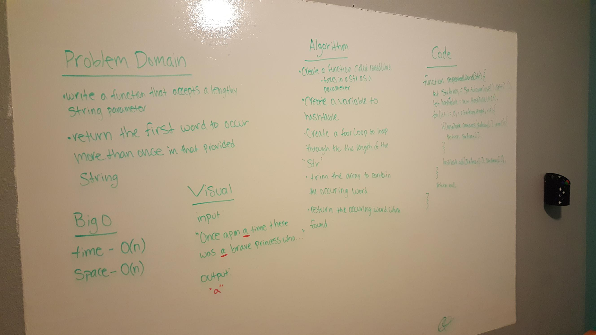
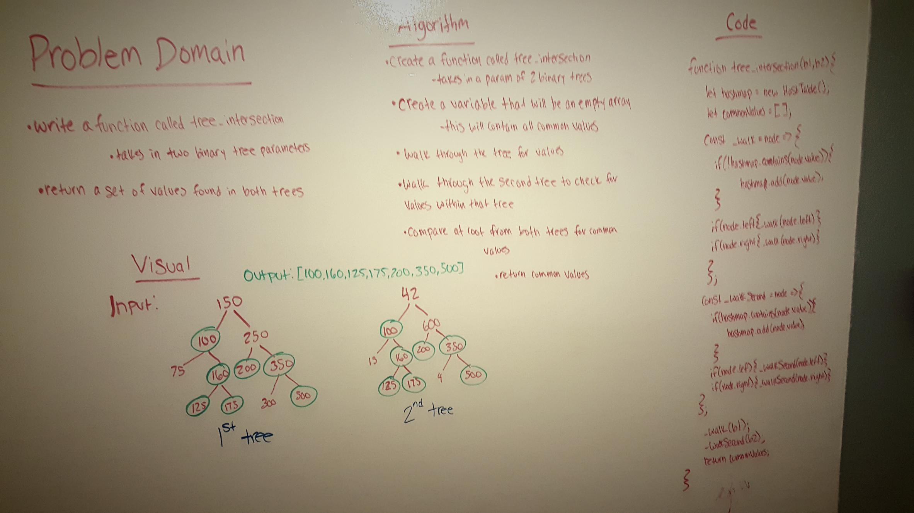
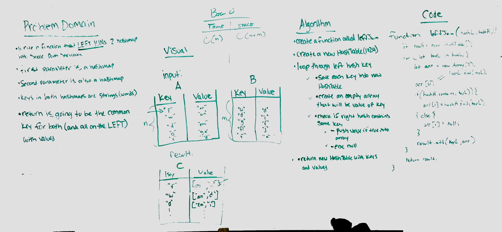

## HashTables

### Author: Siobhan Niess

### Links and Resources
* [repo](https://github.com/niesssiobhan/data-structures-and-algorithms/tree/master/code-challenges/hashTable)
* [travis](https://www.travis-ci.com/niesssiobhan/data-structures-and-algorithms)

### Modules
#### `hashtable.js`
##### Challenge
* A method/function named add that takes in both the key and value. This method should hash the key and add the key and value pair to the table.
* A method/function named Find that takes in the key and returns the value from key/value pair.
* A method/function named contains that takes in the key and returns if the key exists in the table already.
* A method/function named GetHash that takes in a key and returns the index in the array the key is stored.
#### `reapeated-word.js`
##### Challenge 
* Write a function that accepts a lengthy string parameter.
* Without utilizing any of the built-in library methods available to your language, return the first word to occur more than once in that provided string.
#### `tree-intersection.js`
##### Challenge
* Write a function called tree_intersection that takes two binary tree parameters.
* Without utilizing any of the built-in library methods available to your language, return a set of values found in both trees.
#### `left-join.js`
##### Challenge
* Write a function that LEFT JOINs two hashmaps into a single data structure.
* The first parameter is a hashmap that has word strings as keys, and a synonym of the key as values.
* The second parameter is a hashmap that has word strings as keys, and antonyms of the key as values.
* Combine the key and corresponding values (if they exist) into a new data structure according to LEFT JOIN logic.
* LEFT JOIN means all the values in the first hashmap are returned, and if values exist in the “right” hashmap, they are appended to the result row. If no values exist in the right hashmap, then some flavor of NULL should be appended to the result row.
* The returned data structure that holds the results is up to you. It doesn’t need to exactly match the output below, so long as it achieves the LEFT JOIN logic.

## Approach & Efficiency
### Hashtable
* The Big O for this would be O(1) since iit will going through a linked list, looping through an array once.
* My approach was to require in the linked list for my hashtable

### reapatedWord
* The Big O for this would be O(n) since it would have to loop through the lengthof the arry and it could be any length.
* My approach to this was to require in my hashtable and methods and to split it to only contain the first most common word and return it. 

### tree-intersection
* The Big O for this would be O(n) and O(h) since you wouldnt know how deep and wide the trees would be
* My approach for this was to walk trhough each tree down the right side and then down the left side. Them t do the same for the second tree and put all of the common values founf into an empty array. 

### leftJoin
* The Big O for this would be O(n) for the time because you won't know how may keys are going to be in the hash Table. The Big 0 for the space would be O(n+m) because woudl be combining the value of both hashTables.
* My approach to this was to collect all oft he keys flrom the let hashtable and the contain all of the values from both hashtables what share common keys. 

## API
* `hash(key)` 
  * the key is hashed before it is added to the table
* `add(key, value)` 
  * the key is hashed and then the key value pair is added to the hashtable
* `find(key)`
  *  find takes in a key and then the value from the key value pair is the return 
* `contains(key)`
  * a true or false is retruned is a key can be found or not
* `getHash(key)`
  * the index where the key has been hashed from is what is returned 

#### Tests
* How do you run tests?
npm test
* What assertions were made?
* What assertions need to be / should be made?

#### Collaborators
* Fletcher

### To-do list
- [x] Read all of these instructions carefully
- [x] All work in the correct remo
- [x] Work on the correct branch
- [x] Work in the correct folder
- [x] Work in the correct file
- [x] Create the code
- [x] Write at least three test assertions for each method that you define.
- [x] Ensure your tests are passing before you submit your solution.
- [x] Create a pull request from your branch to your master branch
- [x] In your open pull request, leave as a comment a checklist
- [ ] Submitting your completed work to Canvas (soon)
- [ ] Merge your branch into master (soon)

#### Solution

