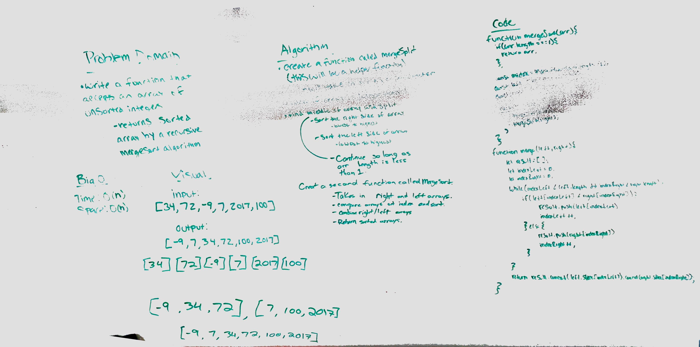

## Sorting

### Author: Siobhan Niess

### Links and Resources
* [repo](https://github.com/niesssiobhan/data-structures-and-algorithms/pull/64)
* [travis](https://www.travis-ci.com/niesssiobhan/data-structures-and-algorithms)

### Modules
#### `merge-sort.js`
##### Challenge
* Write a function that accepts an array of unsorted integers, and returns a sorted array by a recursive mergesort algorithm.

## Approach & Efficiency

## API

#### Tests
* How do you run tests?
npm test
* What assertions were made?
* What assertions need to be / should be made?

#### Collaborators
* Brent

### To-do list
- [x] Read all of these instructions carefully
- [x] All work in the correct remo
- [x] Work on the correct branch
- [x] Work in the correct folder
- [x] Work in the correct file
- [x] Create the code
- [x] Write at least three test assertions for each method that you define.
- [x] Ensure your tests are passing before you submit your solution.
- [x] Create a pull request from your branch to your master branch
- [x] In your open pull request, leave as a comment a checklist
- [ ] Submitting your completed work to Canvas (soon)
- [ ] Merge your branch into master (soon)

#### Solution
