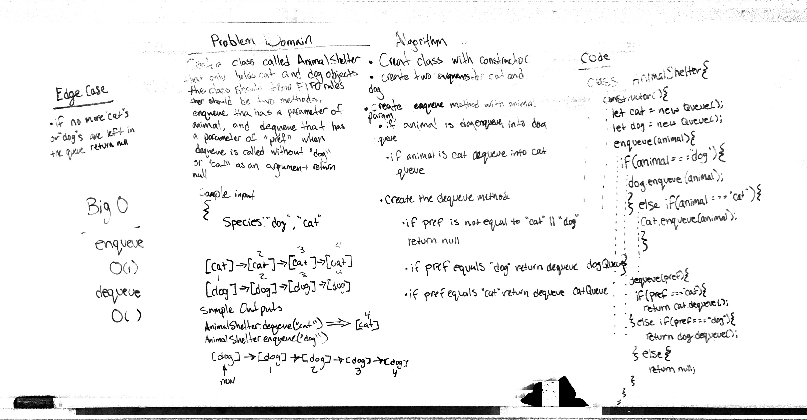

 LAB
=================================================

## Stacks and Queues

### Author: Siobhan Niess

### Links and Resources
* [repo](https://github.com/niesssiobhan/data-structures-and-algorithms/pull/40)
* [travis](https://travis-ci.com/niesssiobhan/data-structures-and-algorithms)

### Modules
#### `stacks-and-queues.js`
##### Challenge
Create a Node class that has properties for the value stored in the Node, and a pointer to the next node.
Create a Stack class that has a top property. It creates an empty Stack when instantiated.
Create a Queue class that has a top property. It creates an empty queue when instantiated.
#### `queue-with-stacks.js`
##### Challenge 
Create a brand new PseudoQueue class. Do not use an existing Queue. Instead, this PseudoQueue class will implement the standard queue interface, but will internally only utilize 2 Stack objects. Ensure that you create your class with the following methods: enqueue(value) which inserts value into the PseudoQueue, using a first-in, first-out approach.
dequeue() which extracts a value from the PseudoQueue, using a first-in, first-out approach.
#### `fifo-animal-shelter.js`
##### Challenge
Create a class called AnimalShelter which holds only dogs and cats. The shelter operates using a first-in, first-out approach.
Implement the following methods:
enqueue(animal): adds animal to the shelter. animal can be either a dog or a cat object.
dequeue(pref): returns either a dog or a cat. If pref is not "dog" or "cat" then return null.
##### Exported Values and Methods

### Setup
#### `.env` requirements
* `PORT` - Defined by ENV

#### Running the app
* `npm start`
* Endpoint: `/`

#### Tests
* How do you run tests?
npm test
* What assertions were made?
* What assertions need to be / should be made?

#### Collaborators
* Becca
* Jacob
* George

#### Solution

