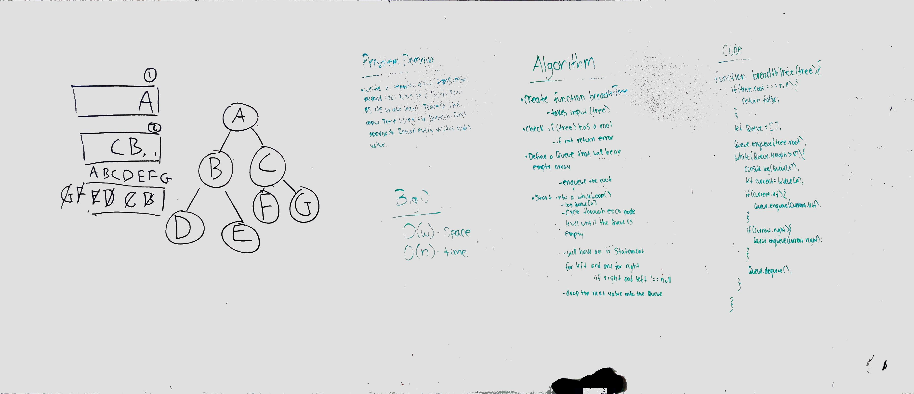

## Trees

### Author: Siobhan Niess

### Links and Resources
* [repo](https://github.com/niesssiobhan/data-structures-and-algorithms/tree/master/code-challenges/tree)
* [travis](https://travis-ci.com/niesssiobhan/data-structures-and-algorithms)

### Modules
#### `tree.js`
##### Challenge
* Create a Node class that has properties for the value stored in the node, the left child node, and the right child node.
* Create a BinaryTree class
  * Define a method for each of the depth first traversals called preOrder, inOrder, and postOrder which returns an array of the values, ordered appropriately.
* Write a function called find-maximum-value which takes binary tree as its only input. Without utilizing any of the built-in methods available to your language, return the maximum value stored in the tree. You can assume that the values stored in the Binary Tree will be numeric.
#### `binarySearchTree.js`
##### Challenge 
* Create a BinarySearchTree class
  * Define a method named add that accepts a value, and adds a new node with that value in the correct location in the binary search tree.
  * Define a method named contains that accepts a value, and returns a boolean indicating whether or not the value is in the tree at least once.
* Write a breadth first traversal method which takes a Binary Tree as its unique input. Without utilizing any of the built-in methods available to your language, traverse the input tree using a Breadth-first approach; print every visited node’s value.
#### `fizz-buzz-tree.js`
##### Challenge
* Write a function called FizzBuzzTree which takes a tree as an argument.
* Without utilizing any of the built-in methods available to your language, determine weather or not the value of each node is divisible by 3, 5 or both, and change the value of each of the nodes:
  * If the value is divisible by 3, replace the value with “Fizz”
  * If the value is divisible by 5, replace the value with “Buzz”
  * If the value is divisible by 3 and 5, replace the value with “FizzBuzz”
*Return the tree with its new values.
##### Exported Values and Methods

### Setup
#### `.env` requirements
* `PORT` - Defined by ENV

#### Running the app
* '/'

#### Tests
* How do you run tests?
npm test
* What assertions were made?
* What assertions need to be / should be made?

#### Collaborators
* Brent
* Tanner
* Caity

### To-do list
- [x] Read all of these instructions carefully
- [x] All work in the correct remo
- [x] Work on the correct branch
- [x] Work in the correct folder
- [x] Work in the correct file
- [x] Create the code
- [x] Write at least three test assertions for each method that you define.
- [x] Ensure your tests are passing before you submit your solution.
- [x] Create a pull request from your branch to your master branch
- [x] In your open pull request, leave as a comment a checklist
- [ ] Submitting your completed work to Canvas (soon)
- [ ] Merge your branch into master (soon)

#### Solution

